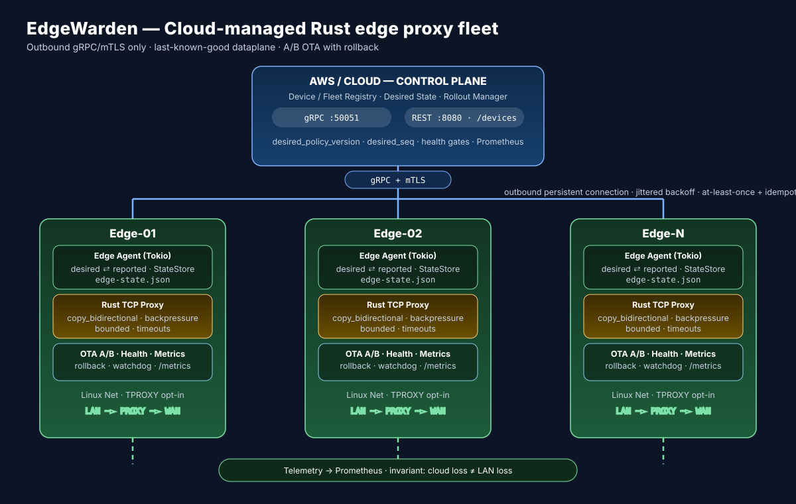
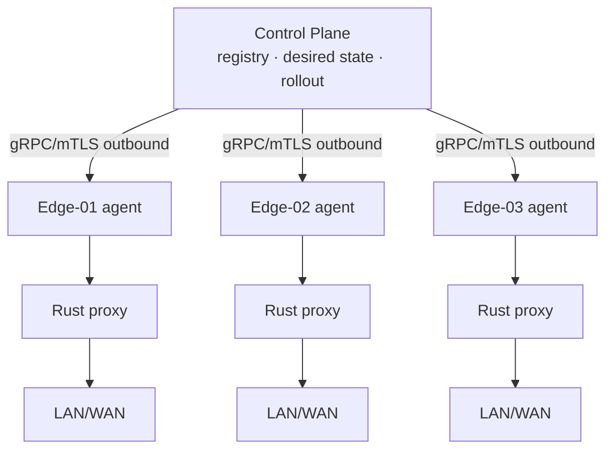

# EdgeWarden

Cloud-managed Rust edge proxy appliance reference architecture.



## Why EdgeWarden

Schools put a proxy appliance between classrooms and the internet, then lose
the cloud link (ISP blip, firewall change, maintenance window) — and classes
go dark because the box was designed cloud-first. EdgeWarden inverts that:
the **dataplane serves from last-known-good unconditionally**, and the cloud
is advisory. Everything else — fleet state, canary OTA, health gates,
telemetry — exists to make that inversion safe to operate at 10k-device
scale.

## Architecture

```text
                     CLOUD

              +------------------+
              |  Control Plane   |
              +--------+---------+
                       |
                   gRPC/mTLS
                       |
           +-----------+-----------+
           |           |           |
        Edge-01     Edge-02     Edge-03
           |           |           |
       Rust Proxy  Rust Proxy  Rust Proxy
           |           |           |
         LAN/WAN     LAN/WAN     LAN/WAN
```

Control plane (cloud) owns *desired* state; each appliance owns *reported*
state plus a durable last-known-good copy. The edge always dials out
(outbound gRPC + mTLS + jittered backoff); the cloud never dials in.
Details: `docs/architecture.md`, `docs/control-plane.md`,
`docs/proxy-datapath.md`.



## Core invariants

> Loss of cloud connectivity must not cause loss of local traffic forwarding.

Proven by `crates/e2e/tests/partition.rs`: connected → policy downloaded →
cloud killed → proxy still forwards → cloud back → auto-reconcile.

## Quick Start

```sh
cargo build --workspace
./target/debug/control-plane &          # gRPC :50051, REST :8080
python3 deploy/docker/echo-upstream.py & # demo upstream :18081
./target/debug/edge-agent --device-id edge-01 &
curl -s localhost:8080/devices | python3 -m json.tool
```

## 3-node local fleet demo

```sh
docker compose -f deploy/compose.yaml up --build
curl -s localhost:8080/devices | python3 -m json.tool
curl -s localhost:19091/metrics | grep edge_policy_version
```

Push policy and watch reconciliation:

```sh
curl -s -X POST localhost:8080/policy -H 'content-type: application/json' \
  -d '{"version":42,"max_connections":512,"idle_timeout_secs":300,"default_upstream":"upstream:18081"}'
sleep 6
curl -s localhost:8080/devices | grep -E 'device_id|reported_policy'
```

## Practical usage examples

Real tasks operators perform with this repo (all runnable locally):

**1. Survive a 9 AM ISP outage without losing classrooms.**
Kill the control plane mid-day; forwarding continues on last-known-good and
reconciles when the link returns. This is the partition test made manual:

```sh
printf 'lesson-plan' | ncat 127.0.0.1 18080   # works while cloud is up
# stop control-plane (Ctrl-C / docker stop)
printf 'still-teaching' | ncat 127.0.0.1 18080  # still echoes back
# restart control-plane; agent re-registers and converges automatically
```

**2. Roll out a stricter filtering policy to one school before the district.**
Bump desired policy, confirm one edge converges and error counters stay flat,
then promote fleet-wide:

```sh
curl -s -X POST localhost:8080/policy -H 'content-type: application/json' \
  -d '{"version":43,"max_connections":256,"idle_timeout_secs":120,"default_upstream":"upstream:18081"}'
sleep 6
curl -s localhost:8080/devices | grep reported_policy   # expect 43
curl -s localhost:19091/metrics | grep -E 'edge_proxy_errors_total|edge_policy_version'
```

**3. Prove the 8:00 AM bell won't melt the proxy.**
Replay the connection storm against a real proxy and keep the JSON as your
capacity receipt:

```sh
./target/debug/storm --target 127.0.0.1:18080 --clients 500 --rounds 10 \
  --payload-bytes 1024 --out /tmp/storm.json
cat /tmp/storm.json   # conns/sec, p50/p95/p99, errors, RSS
```

**4. Ship an OTA to canary, watch a bad build roll itself back.**
The state machine is exercised directly (no real partitions touched):

```sh
cargo test -p edge-ota -- --nocapture
# successful_update_flips_slot ... ok        (B becomes active)
# health_failure_rolls_back_to_a ... ok      (auto-rollback, A stays active)
# corrupt_artifact_fails_verify ... ok       (hash gate)
# bad_signature_fails_verify ... ok          (signature gate)
```

Pair with canary gates in code (`control-plane::rollout`): a ring whose
crash rate, proxy error rate, or health-check failures breach thresholds
**pauses and never auto-resumes** — an operator must `resume()`.

**5. Triage "is it the edge or the cloud?" in one minute.**
Device registry plus Prometheus answers it without SSH:

```sh
curl -s localhost:8080/devices | python3 -m json.tool  # reported vs desired, last_seen age
curl -s localhost:19091/metrics | grep -E 'edge_control_plane_connected|edge_proxy_active|edge_cpu_usage|edge_ota_rollback'
./scripts/failure-demo.sh   # end-to-end fault tour: outage, crash, corrupt config, bad OTA
```

**6. Stand up enforced mTLS for a pilot school.**
Mint short-lived dev certs (7-day, gitignored) and restart both ends. The
server refuses one-way TLS, and the agent fails fast on a half-configured
identity — there is no silent downgrade:

```sh
./scripts/gen-certs.sh certs
CONTROL_TLS_CERT=$PWD/certs/server.crt CONTROL_TLS_KEY=$PWD/certs/server.key \
  CONTROL_TLS_CLIENT_CA=$PWD/certs/ca.crt ./target/debug/control-plane &
EDGE_TLS_CA=$PWD/certs/ca.crt EDGE_TLS_CERT=$PWD/certs/edge-01.crt EDGE_TLS_KEY=$PWD/certs/edge-01.key \
  EDGE_CONTROL_PLANE=https://127.0.0.1:50051 ./target/debug/edge-agent &
curl -s localhost:8080/devices | grep -E 'device_id|reported_policy'  # enrolled over mTLS
# production: replace with EST/SPIRE-issued certs + pinned CA (docs/security.md)
```

**7. Restart the control plane without losing the fleet.**
Registry snapshots persist roster + desired state; liveness ages out until
edges check in again:

```sh
CONTROL_PERSIST_PATH=/var/lib/edgewarden/registry.json ./target/debug/control-plane &
curl -s -X POST localhost:8080/policy -H 'content-type: application/json' -d '{"version":44}'
# restart the control plane process; /devices still lists the fleet and version 44
```

**8. Wire a real bypass relay.**
`MockBypassController` is for dev/test. Production sites plug hardware
commands into `ExecBypassController` (failed commands leave state unchanged
so the supervisor retries instead of assuming the relay moved):

```rust
let bypass = ExecBypassController::new(
    "/usr/local/sbin/bypass-nic on",
    "/usr/local/sbin/bypass-nic off",
    Duration::from_secs(5),
);
```

## TCP dataplane

Tokio `copy_bidirectional`, semaphore-bounded concurrency, connect + idle
timeouts, graceful drain, atomic counters. TPROXY is opt-in and isolated
(`edge-proxy::transparent`, `scripts/nftables-example.sh`); dev mode needs
no root. See `docs/proxy-datapath.md`.

## Fleet control plane

`Register` / `Heartbeat` / `Watch` (bidi) / `ReportTelemetry`, plus
`GET /devices`, `POST /policy`. Outbound-only with jittered backoff.
See `docs/control-plane.md`.

## Desired vs reported state

Cloud: `desired{seq, policy_version}` (monotonic). Edge:
`reported{policy_version, applied_seq}` + `edge-state.json`. Diff yields
idempotent `ApplyPolicy` / `StageOta` / `Noop`; duplicates and stale seq are
safe. At-least-once, never exactly-once. See `docs/adr/ADR-002*`, `ADR-003`.

## Network partition behaviour

Cloud loss flips `edge_control_plane_connected=0` and schedules reconnect;
the accept loop never stops. Restarting the cloud replays the newest desired
state and the edge converges. See `docs/failure-model.md`,
`docs/adr/ADR-006`.

## OTA / rollback

A/B slots + journaled state machine
(`Idle → Downloading → Verifying → Staged → RebootPending →
BootingCandidate → HealthChecking → Committed`, with `RollbackPending →
RolledBack` / `Failed`). SHA-256 + Ed25519 release-signature verify,
journaled rollback protection (signed downgrades rejected), crash/power-loss
recovery tested. Production maps slots to a real bootloader (`rauc` /
`bootupd` / dm-verity) and keys to a KMS/HSM. See `docs/ota.md`.

## Security model

rustls + enforced mTLS (server requires device client certs, agent fails
fast on half-TLS), pinned CA, per-device identity, Ed25519 OTA signatures,
crash-safe registry snapshots, least-privilege containers (`USER 10001`,
`cap_drop: ALL`, read-only FS, resource limits, healthchecks),
`cargo audit` clean of vulnerabilities, no committed secrets. Dev PKI via
`scripts/gen-certs.sh`. Threat model (compromised edge, MITM, stolen cert,
malicious update, replay, rollback, control-plane compromise) in
`docs/security.md`.

## Observability

Prometheus `/metrics` on every edge: connections, bytes, errors, latency
histogram, CPU/RSS, `edge_control_plane_connected`, reconnects, policy
version, OTA success/rollback. Scraped by `deploy/prometheus.yml`.

## Performance testing

`storm` (T=0 thundering herd) + Criterion benches + flamegraph/perf notes.
Measured locally (debug build, loopback, 200 clients × 10 × 1024 B):
**2000 requests, 0 errors, 1887 conns/sec, 309 Mbps, p50 0.77 ms / p95
47.7 ms / p99 82.5 ms** — full JSON in `benchmarks/storm-local.json`.
Architectural expectations are labelled as such. See `docs/performance.md`.

## Failure injection

`crates/e2e/tests/{partition,reconcile,failures,mtls}.rs` plus
`./scripts/failure-demo.sh` (outage, crash, corrupt config, invalid policy,
bad OTA, duplicates, stale state, mTLS rejection).

## Linux transparent proxy mode

Portable mode by default. For interception: nftables → TPROXY →
`IP_TRANSPARENT` listener → `SO_ORIGINAL_DST` recovery. See
`scripts/nftables-example.sh`, `docs/proxy-datapath.md`, `docs/adr/ADR-007`.

## Architecture decisions

`docs/adr/ADR-001` gRPC vs MQTT · `ADR-002` desired/reported ·
`ADR-003` at-least-once · `ADR-004` immutable edge · `ADR-005` A/B OTA ·
`ADR-006` dataplane independence · `ADR-007` TPROXY · `ADR-008` eBPF
boundaries (userspace first; no buzzword eBPF shipped).

## Development

```sh
cargo fmt --check
cargo clippy --workspace --all-targets --all-features -- -D warnings
cargo test --workspace
cargo bench
./scripts/failure-demo.sh
```

5-minute demo script: `docs/interview-demo.md`.

## Production readiness

What "production-ready" means here, and where it stands:

- **Enforced mTLS** — done: mutual verification both directions, fail-fast
  on misconfiguration, covered by `crates/e2e/tests/mtls.rs`. Remaining:
  per-device enrollment/rotation via EST/SPIRE or cloud IoT PKI.
- **Signed, rollback-protected OTA** — done: Ed25519 verify + journaled
  downgrade rejection. Remaining: bootloader integration (`rauc`/`bootupd`),
  KMS/HSM release keys, multi-signer quorum (Sigstore/TUF).
- **Durable fleet state** — done: crash-safe registry snapshots
  (`CONTROL_PERSIST_PATH`). Remaining: multi-replica control plane
  (Raft/Postgres) for cloud-side HA.
- **Fail-open hardware** — interface + `ExecBypassController` done and
  tested; the relay itself is site hardware by definition
  (`MockBypassController` stays for dev/test).
- **Hardened deployment** — done: least-privilege users, dropped
  capabilities, read-only FS, resource limits, healthchecks, persistent
  volumes, `cargo audit` with zero vulnerabilities.
- **Measured performance** — done: `benchmarks/storm-local.json` from a
  real run (see above), plus a Docker-fleet run (500 reqs, 0 errors during
  a control-plane outage). Re-run on your hardware before quoting capacity.
- **Docker Compose demo** — done and executed: 3 edges registered, policy
  42 reconciled fleet-wide, echo verified on all proxies, cloud killed
  (forwarding + storm clean), cloud restored with registry persistence
  (seq continued), policy 43 reconciled, Prometheus `up` on all edges.
  Note: this host already runs an app on :8080, so run the demo with the
  control-plane REST on :8081 (override file or `ports` tweak).
