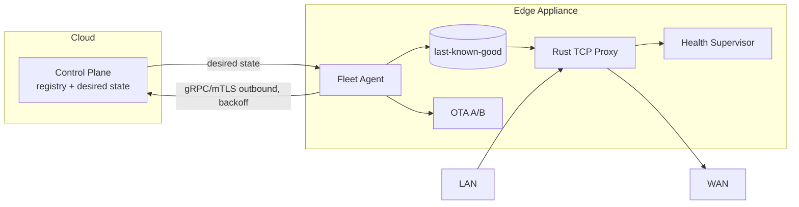

# Architecture

See `README.md` for the overview diagram (`docs/assets/edgewarden-architecture.svg`).

## Control plane vs data plane

- **Control plane** (`control-plane` crate, Cloud): device registry, desired
  state, rollout manager, operator REST. It is *advisory*: the edge works
  without it.
- **Data plane** (`edge-proxy`, on-appliance): Tokio TCP forwarding,
  bounded concurrency, backpressure via TCP windows, idle/connect timeouts.
  It reads last-known-good policy from disk and never blocks on the cloud.

Critical invariant:

> Loss of cloud connectivity must not cause loss of local traffic forwarding.

Mechanism: `edge-agent` persists every applied policy (`edge-state`
`StateStore`, atomic rename). The proxy boots from that file. Heartbeat
failures only increment `edge_reconnect_total` and schedule a jittered
reconnect; they never stop the accept loop. Proven by
`crates/e2e/tests/partition.rs` (7-step scenario).

## Crates

| Crate | Role |
|---|---|
| `edge-protocol` | `proto/fleet.proto` bindings + jittered backoff |
| `edge-state` | desired/reported diff, idempotent apply, durable store |
| `edge-proxy` | Tokio dataplane, `transparent` TPROXY isolation |
| `edge-agent` | outbound-only sync, reconciliation loop |
| `control-plane` | registry, rollout gates, gRPC + REST |
| `edge-ota` | persistent A/B state machine simulation |
| `edge-health` | probes, watchdog, `BypassController` trait |
| `edge-telemetry` | Prometheus metrics + `/metrics` server |
| `storm` | school-start load generator, JSON results |
| `e2e` | partition / reconcile / failure integration tests |

## Data flow

## Linux networking

Portable mode is a plain `TcpListener` forward. Transparent mode
(`edge-proxy::transparent`, `scripts/nftables-example.sh`) uses
`IP_TRANSPARENT` + `SO_ORIGINAL_DST` to recover the original destination
after nftables TPROXY diversion. The two modes are separated so tests never
need root.
